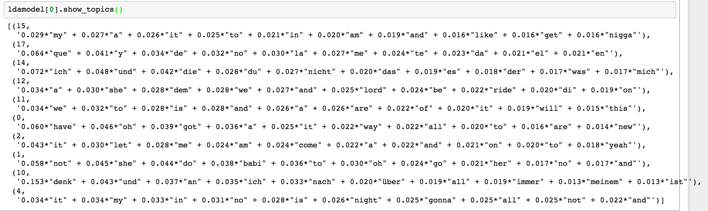
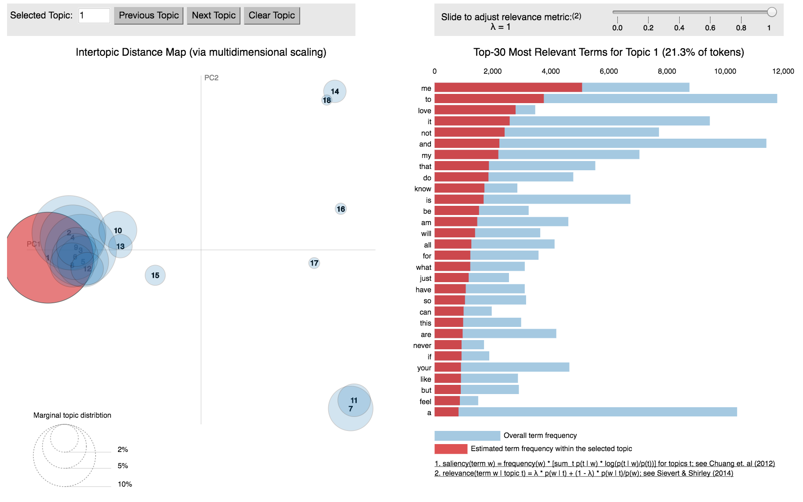
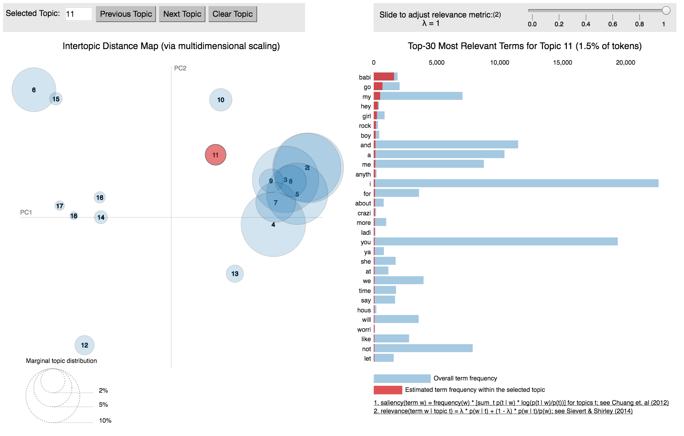

# Project 4 Words for Music
 
### Jiayi Wang (jw3316)

***
## Overview of Methodology (Things I Tried...)
### I. Feature Selection 	[Code](https://github.com/TZstatsADS/Fall2016-proj4-Jiayiwang7/tree/master/lib/Feature-Extraction)
a. Select features according to type and dimension

b. Extract Statistics (Mean, Standard Deviation, Quantiles...)

c. Truncate features into same dimension
### II. Unsupervised Feature Clustering [Code](https://github.com/TZstatsADS/Fall2016-proj4-Jiayiwang7/tree/master/lib/EM_Method)
a. Expectation Maximization with Gaussian Mixture Model

b. Connect Word Frequency of Each Cluster
### III. Topic Modeling for Lyrics  [Code](https://github.com/TZstatsADS/Fall2016-proj4-Jiayiwang7/tree/master/lib/Topic-Model)
Latent Dirichlet Allocation

### IV. Multi Target Regression on Each Word [Code](https://github.com/TZstatsADS/Fall2016-proj4-Jiayiwang7/tree/master/lib/MultiOutputRegressor)
a. Gradient Boosting Regressor

b. Random Forest Regressor


### V. Choice of Final Method [Code](https://github.com/TZstatsADS/Fall2016-proj4-Jiayiwang7/blob/master/lib/Final_Method_Process.ipynb)
a. Based on Cross-Validation (use 2200 samples for training, 150 for tesing)

b. Criteria: predictive rank sum  [Code](https://github.com/TZstatsADS/Fall2016-proj4-Jiayiwang7/blob/master/lib/Evaluation_Predictive_Rank_Sum.py)

Result of each method I tried:

|music feature + topic modeling| music feature for clustering|multi target regression on each word|baseline: sum word frequency for all songs and give same rank according to rank sum|
| ------------- |-------------|-----| -----|-----|
| predictive rank sum (for 150 testing songs)| 0.32 | 0.24| 0.48|0.26|

Thus, according to the score given above, I chose  music feature for clustering method. In detail, I firstly implement expectation-maximization (EM) algorithm for fitting mixture-of-Gaussian models. Tune the number of Gaussian clusters based on Cross-Validation (Criteria based on predictive rank sum). The best number of cluster is 10. Thus I use 10 clusters. Based on the fact that sometimes using many fancy unsupervised models(k-means, em, topic model) will not increase the accuracy, simply count word frequency of songs in each cluster generated. For each new song, predict which cluster it belongs, and rank word by the cluster word frequency.

***
## Feature Selection 
### I. Statistics (Mean, Standard Deviation, Maximum, Minimum, 25%, 50%,  75% Quantiles, Range)
The below row features are 1 dimension features related to time, thus choose summary statistics & quantiles as features

[segments_start, segments_confidence, segments_loudness_max_time, sections_start, sections_confidence, beats_start, beats_confidence, bars_start, bars_confidence, tatums_start, tatums_confidence]


### II. Truncate 
For row features with 2D space, truncate each with same length

[segments_pitches, segments_timbre, segments_loudness_max, segments_loudness_start]

### III. Reference Code (Python)
a. Read attributes in '/analysis'
```python
def get_list_attr(path_list, attr):
    attr_list = []
    i = 1
    
    for file in path_list:
        try:
            file_read = hdf5_getters.open_h5_file_read(file)
            attr_list.append(hdf5_getters.__getattribute__(attr)(file_read))
            file_read.close()
            i += 1
        except:
            print '---- Failed to get ' + file + ' ---- No:' + str(i)
            attr_list.append(0)
            i += 1           
    return(attr_list)
```
b. Calculate statistics of selected features
```python
def stat(attr):
    ls = []
    for l in attr:
        try:
            stats = [np.max(l), np.min(l), np.mean(l), np.var(l), np.ptp(l),
            np.percentile(l, 25), np.percentile(l, 50), np.percentile(l, 75)]
            ls.append(stats)
        except ValueError:
            ls.append([0] * 8)
    return(ls)
```
c. Conbine different features
```python
def cmbfat(attr_ls):
    ls0 = attr_ls[0]
    for l in attr_ls[1:]:
        for i in range(len(ls0)):
            ls0[i] += l[i]
    return(ls0)
```

***
## Unsupervised Feature Clustering
### I.  Expecation Maximization
Implement expectation-maximization (EM) algorithm for fitting mixture-of-Gaussian models.

Tune the number of Gaussian clusters based on Cross-Validation (Criteria based on predictive rank sum)

```python
def em_model(df_train, num_cluster):
    # return EM model
    df = pd.DataFrame(df_train,  index = df_train.index.tolist())
    gmm = mixture.GaussianMixture(n_components = num_cluster, covariance_type='full')
    model = gmm.fit(df_train)
    return(model)
```

### II. Word frequency of Each Cluster
a. Based on the fact that sometimes using many fancy unsupervised models(k-means, em, topic model) will not increase the accuracy, simply count word frequency of songs in each cluster generated. 
```python
def word_cluster_table(model, df_train):
    
    # return word frequency for each cluster

    pred = model.predict(df_train)
    df_cluster = pd.DataFrame({'file_1': df_train.index.tolist(), 'cluster':pred, 'count': 1})
    df_word = pd.read_csv('lyr.csv')
    
    for i in range(len(pd.Series.unique(df_cluster['cluster']))):
        if i == 0:
            tmp_ini = df_cluster.loc[df_cluster['cluster'] == i]
            result_ini = pd.concat([tmp_ini, df_word], axis=1, join='inner')
            df_s_ini = result_ini.drop('file_1', 1)
            #cnt_ini = len(df_s_ini)
            sum_c_ini = df_s_ini.sum(axis=0)
            ls_wd = sum_c_ini.to_frame()
            #ls_word['cnt'] = cnt_ini
        else:
            tmp = df_cluster.loc[df_cluster['cluster'] == i]
            result = pd.concat([tmp, df_word], axis=1, join='inner')
            df_s = result.drop('file_1', 1)
            cnt = len(df_s)
            sum_c = df_s.sum(axis=0)
            ls_sum = list(sum_c)
            #ls_sum.append
            ls_wd[i] = ls_sum
        ls_word = ls_wd.transpose()
        ls_word = ls_word.drop('dat2$track_id', 1).drop('cluster', 1)
        
    return(ls_word)
```
b. For each new song, predict which cluster it belongs, and rank word by the cluster word frequency.

```python
def test_model(cluster_table, model, df_test):
    
    # return predicted word rank
    pred_test = model.predict(df_test)
    cluster_table['cluster'] = range(len(cluster_table))
    pred_test = model.predict(df_test)
    pred_cluster = pd.DataFrame({'file_1': df_test.index.tolist(), 'cluster':pred_test})

    for i in range(len(pred_cluster)):
        if i == 0:
            pre_c_word = cluster_table.loc[cluster_table['cluster'] == pred_cluster.ix[i][0]]
            pre_c_word['track_id'] = pred_cluster.ix[i][1]
        else:
            tmp = cluster_table.loc[cluster_table['cluster'] == pred_cluster.ix[i][0]]
            tmp['track_id'] = pred_cluster.ix[i][1]
            pre_c_word = pd.concat([pre_c_word, tmp])
    index = pre_c_word['track_id'].tolist()
    word_test = pre_c_word.ix[:,'blank_': 'zwei']
    word_test.index = index
    
    
    for i in range(len(word_test)):
        ls_freq = word_test.iloc[[i]].values.tolist()[0]
        ls_ne = [-x for x in ls_freq]
        rank = rankdata(ls_ne).tolist()
        #seq = sorted(ls_freq, reverse = True)
        #rank = [seq.index(v)+1 for v in ls_freq]
        word_test.iloc[i] = rank
    
    return(word_test)
```


***
## Topic Modeling for Lyrics
### I. Latent Dirichlet Allocation

In order to fit a topic model, first generate a lyrics corpus using 'lyr.RData'. 

Second, fit LDA topic model based on corpus generated.

Below shows 10 topic of a 15 topics model, each of which contains the word distribution.




### II. Visualization of Topics
Below shows 10 topic LDA model



Below shows 15 topic LDA model



### III. Reference Code (Python with Gensim)
```python
def topic_model(df_w, n_topic):
    track_id = df_w['dat2$track_id'].tolist()
    df_w.index = track_id
    df_topic = df_w.drop('dat2$track_id', 1)
    word_dic = df_topic.columns.values
    ly_text = []
    en_stop = ['i', 'you', 'the']
    for i in range(len(df_topic)):
        cnt = list(df_topic.ix[i])
        tmp_ls = []
        for j in range(len(cnt)):
            tmp = cnt[j] * [word_dic[j]]
            tmp_ls += tmp
        tmp_ls = [i for i in tmp_ls if not i in en_stop]
        ly_text.append(tmp_ls)
    dictionary = corpora.Dictionary(ly_text)
    corpus = [dictionary.doc2bow(text) for text in ly_text]
    ldamodel = models.LdaModel(corpus, num_topics=18, id2word = dictionary, passes=20)
    return [ldamodel, corpus, dictionary]
```


## Multi Target Regression on Each Word
Directly treat each word as target and fit a regression model predicting frequency of each word
### I. Gradient Boosting Regressor
```python
def multi_GB(feature):
    
    from sklearn.multioutput import MultiOutputRegressor
    from sklearn.ensemble import GradientBoostingRegressor
    import pandas as pd
    from sklearn.externals import joblib
    
    x = feature
    test_words = pd.read_csv('lyr.csv')
    test_w = test_words.ix[:,'blank_':]
    test_w.index = test_words['dat2$track_id'].tolist()
    y = test_w
    clf = MultiOutputRegressor(GradientBoostingRegressor(random_state = 7)).fit(x, y)

    return clf
```

### II. Random Forest Regressor
Fit multi output regression with random forest regressor 

```python

def multi_RF(feature, n_t, n_d):
    
    from sklearn.multioutput import MultiOutputRegressor
    from sklearn.ensemble import RandomForestRegressor
    import pandas as pd
    from sklearn.externals import joblib
    
    x = feature
    test_words = pd.read_csv('lyr.csv')
    test_w = test_words.ix[:,'blank_':]
    test_w.index = test_words['dat2$track_id'].tolist()
    y = test_w
    clf = MultiOutputRegressor(RandomForestRegressor(n_estimators = n_t, 
    max_depth = n_d, 
    random_state = 7)).fit(x, y)
    return clf
```

***
## Choice of Final Method
### I. Seperate Sample for Cross-Validation
Select 2200 samples for clustering, and 150 for testing.

Use the evaluation criteria provided.

Calculate predictive rank sum for testing data

Choose the best cluster number.

Compare with baseline model (sum all word frequency for testing data)
```python
def eval_score(test_words, rank_table):
    
    test_w = test_words.ix[:,'blank_':]
    test_w.index = test_words['dat2$track_id'].tolist()
    
    results = []
    for i in range(len(test_w.index)):
        ls = test_w.ix[i].nonzero()[0].tolist()
        words_rank = rank_table.ix[i].iloc[ls].tolist()
        rank_bar = sum(words_rank)/(len(ls) * sum(rank_table.ix[i])/5000)
        results.append(rank_bar)
    return(results)
```

### II. Final Method
Result of each method I tried:

| |music feature + topic modeling| music feature for clustering|multi target regression on each word|
| ------------- |-------------|-----| -----|
| predictive rank sum (for 150 testing songs)| 0.32 | 0.25| 0.48

The multi target regression on each word method maintains 0.03 predictive rank sum on training songs, but did very poor on testing set due to overfitting.


Thus, according to the score given above, I chose  music feature for clustering method. In detail, I firstly implement expectation-maximization (EM) algorithm for fitting mixture-of-Gaussian models. Tune the number of Gaussian clusters based on Cross-Validation (Criteria based on predictive rank sum). The best number of cluster is 10. Thus I use 10 clusters. Based on the fact that sometimes using many fancy unsupervised models(k-means, em, topic model) will not increase the accuracy, simply count word frequency of songs in each cluster generated. For each new song, predict which cluster it belongs, and rank word by the cluster word frequency.

I also compared the result with baseline method(simply count sum word frequency and rank it same for every song), it seems like the lyrics and music features do not share high correlation. Thus, small number of cluster of my model would perform better.


```python

```
